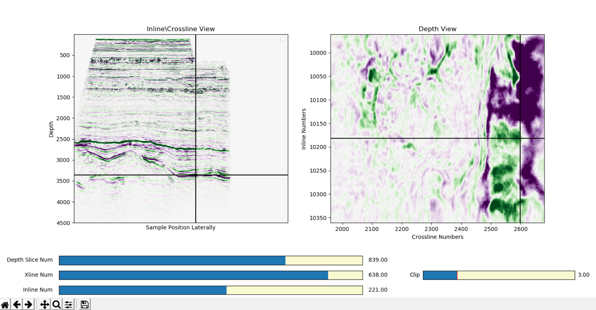
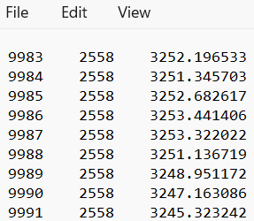
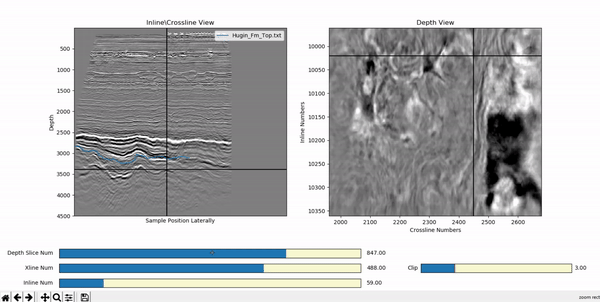
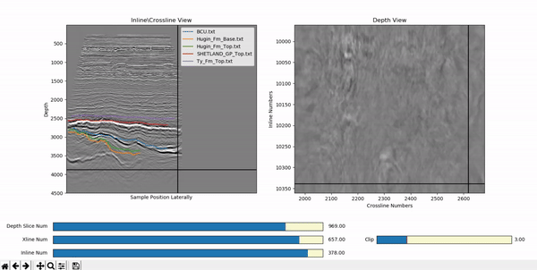

# 💡 Introduction
Despite some of its incompatibilities with Python, the SEG-Y format still happens to be a popular choice to store seismic datasets
in. Professional seismic visualization and interpretation softwares like Petrel come with expensive licenses that puts them out of reach 
for ML enthusiasts looking to apply their skills for interpretation. Python-based 3D visualization engines like Mayavi 
etc., are hard to sometimes configure and install. Moreover, by converting SEG-Y formatted seismic to 3D numpy arrays, they 
lose sense of the actualy geometry of the survey in terms of its absolute crossline, inline, and depth/time values. They are
thus not able to load interpretations created by professional softwares on the seismic data in terms of the actual survey geometry, such as horizons.


SeisWiz is a light-weight Matplotlib-based seismic visualization tool that aims to overcome many of the shortcomings with Python-based seismic 
viewers described above. It has a minimal number of dependencies that are for the most part just standard Python packages people
already work with 90% of the time. It offers an interactive Matplotlib environment to inspect seismic volumes stored in SEG-Y format, 
provides support for multi-view visualization that makes it easy to make correspondences in three dimensions, and further allows to load
seismic horizons produced by software such as Petrel to view along with the seismic data in the background.  

The current functionality includes:

✅ Loading unstructured seismic volumes in Python from .segy files (where `segyio.cube` does not work) <br>

✅ Multi-view support to concurrently visualize orthogonal slices along all three axes in a 3D seismic volume <br>

✅ Sliders to allow dynamic scrolling of all the various slices displayed in the interactive Matplotlib environment <br>

✅ Positional markers to convey the relative positions of the various slices with respect to each other <br>

✅ Dynamically changing the saturation applied to grayscale seismic images <br>

✅ Loading horizon-picks formatted as text files to visualize along with the seismic data in the background <br>

# 💻 Installation
To install SeisWiz, first create an Anaconda environment in a terminal by running
```commandline
conda create --name seismic_viewer python=3.7
```

Next clone the repository by running
```commandline
git clone https://github.com/amustafa9/SeisWiz.git
```

Afterwards, install the required packages by running 
```commandline
cd SeisWiz
pip install -r requirements.txt
```

# 🏃 Running SeisWiz
The current version of Seiswiz can be used in three basic modes:
1. Viewing a seismic volume by itself
2. Loading a specific horizon file along with the seismic volume of interest 
3. Bulk loading multiple horizon files along with a specific seismic volume

## Loading a Seismic Volume on SeisWiz
To visualize a specific seismic volume contained in a `.segy` file, run
```commandline
python scripts/main.py -i <path/to/segy>
```
This should bring up a matplotlib figure like the one shown below:


There are two images that you see on the figure above. The image on the left is a stitch of the two orthogonal 
sectional views (inline and crossline) through the seismic volume joined at the vertical black line. The portion of the 
image left of this black line is the current inline section (as selected on the inline slider) and the portion of the image to the
right of this line is the current crossline section (as selected on the crossline slider). 

The horizontal black line on this image shows the position of the current depth/time slice through the volume (as selected 
on the depth/time slider). The depth/time slice shows all of the inline numbers on the vertical axis
and crossline numbers on the y-axis.

To render the seismic data in a different colormap, you can specify a matplotlib-compatible 
colormap using the `-cmap` argument. See example below:

```commandline
python scripts/main.py -i <path/to/segy> -cmap PRGn
```

This should render the volume in the specified colormap, as below: 


## Loading a Seismic Volume on SeisWiz along with a Specific Horizon File
Seiswiz requires horizon picks to be contained in a text file in three columns in this order: inline, crossline, time/depth. 
The columns are separated by spaces and should have no names or other header information. An example of a horizon file
formatted in this manner is shown in the screenshot below: 



Running Seiswiz to visualize a seismic volume with the horizon of interest superimposed is done by 
running

```commandline
python scripts/main.py -i <path/to/segy> -hor <path/to/horizon>
```

Executing this should result in the following interactive window popping up: 



## Loading a Seismic Volume on SeisWiz along with a Multiple Horizon Files
To simultaneously load multiple horizon files, place them all in a folder and pass the path to this 
folder as shown in the command below:

```commandline
python scripts/main.py -i <path/to/segy> -hor <path/to/horizon/folder>
```

This should result in the following interactive plot where multiple horizons can be 
visualized along with the seismic in the background. 



# ✌ Tips and Tricks
1. To visualize the full length of inline sections, move the crossline slider all the way to its maximum position. By scrolling
   the inline slider, you will now be looking at the entire width of the inlines.
2. To visualize the full length of crossline sections, move the inline slider all the way to its lowest position. By scrolling
   the crossline slider, you will now be looking at the entire width of the crosslines.
3. You can use the zoom function in matplotlib to analyze a window of interest (on either the sectional or time slice views) in more detail.
   You can scroll through the volume keeping the zoom function on too.


# 🔧 Issues 
If you run into any issues with installation or execution of the instructions above, please feel free to reach out to me 
at <span style="color:red"> ahmadmustafa.am@gmail.com </span>. Alternatively, you may create an issue on GitHub and I will look into it.

